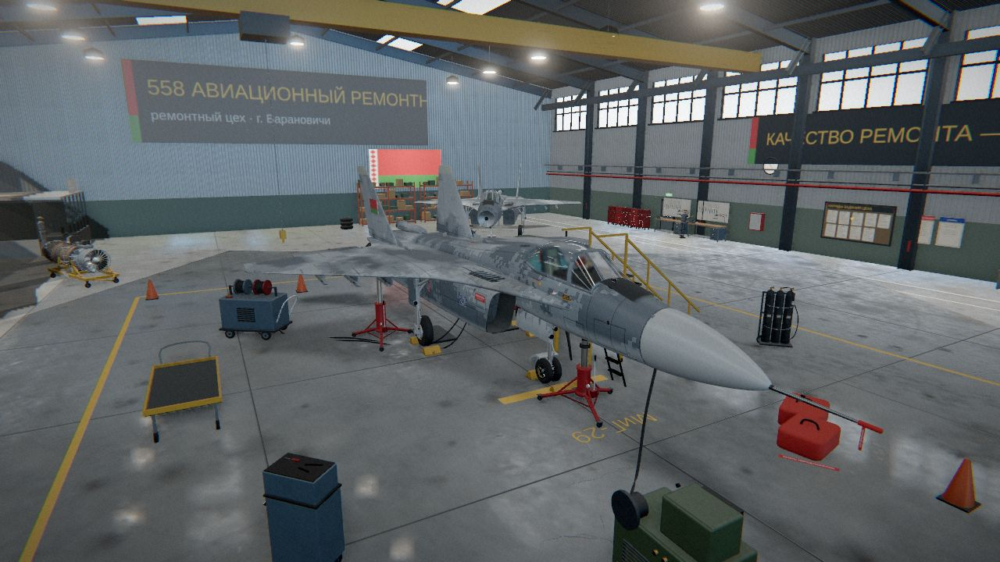
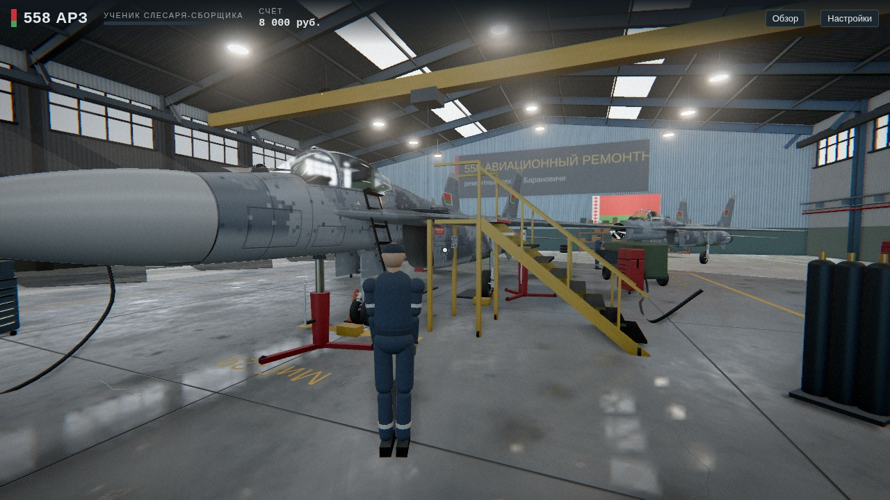
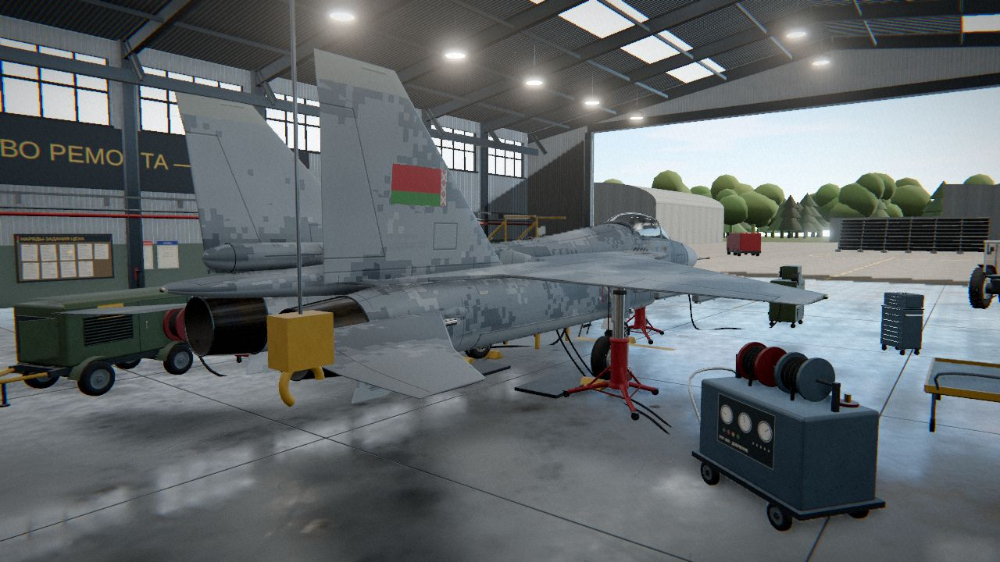
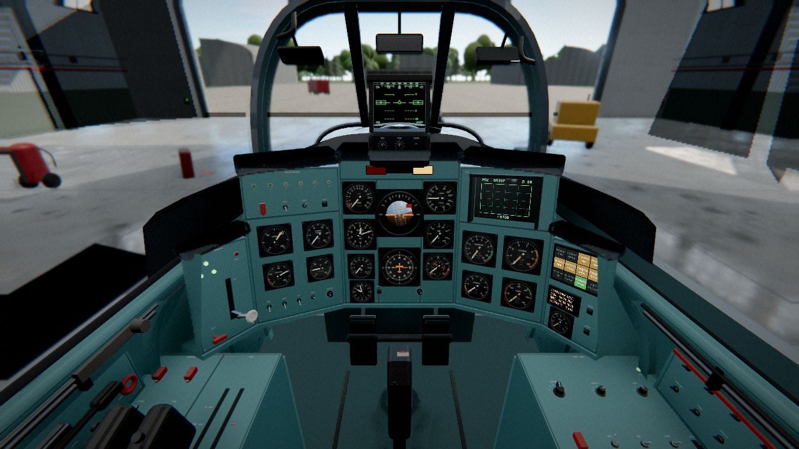
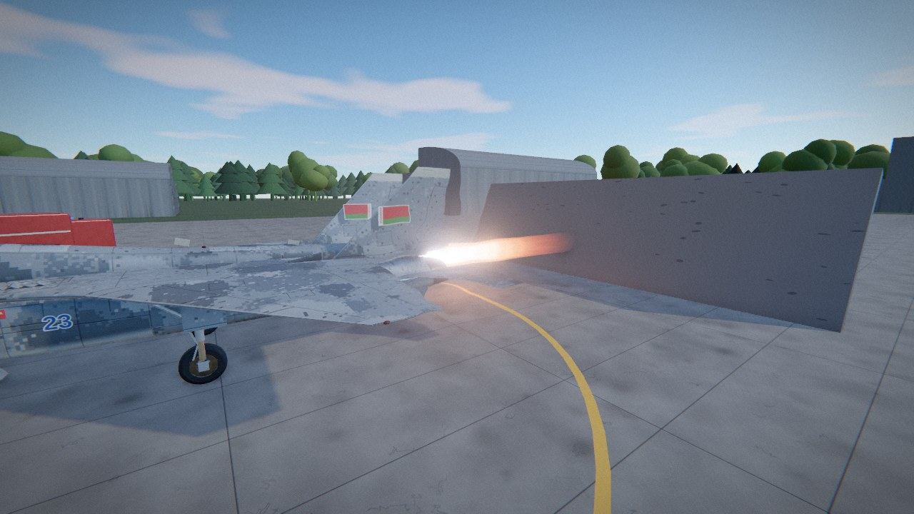

# 558 АРЗ — ремонт МиГ-29БМ

3D-симулятор авиатехника ремонтного цеха 558 авиационного ремонтного завода (Барановичи).
Персонаж ходит по ангару от первого или третьего лица, сам подходит к самолёту, поднимается на стремянку,
открывает фонарь, садится в кабину и своими руками дефектует, снимает и ставит узлы МиГ-29БМ.

**Играть:** откройте `dist/index.html` в браузере (Chrome, Edge, Firefox, Safari с WebGL2). Файл самодостаточный — three.js и весь код встроены.



| | |
|---|---|
|  |  |
|  |  |

## Управление

| Клавиша | Действие |
|---|---|
| Щелчок по экрану | захват мыши, взгляд |
| W A S D / стрелки | ходьба |
| Shift | бег |
| Ctrl (или X) | присесть — под фюзеляж и мотогондолы |
| Пробел | прыжок |
| E | действие с объектом под прицелом (деталь, фонарь, ворота, доска нарядов, терминал, склад, тягач, КПА, ОТК) |
| Q | стремянка в кабину / сесть в кабину / выйти |
| F | фонарик |
| T | вид от 1-го / 3-го лица |
| C | режим обзора камерой (как в версии 1) |
| Esc / Tab | планшет с меню работ |
| N Z I V M B G R O H | наряды, задание, режим осмотра, ведомость, снабжение, склад, гонка РД-33, РЛС, ОТК, справка |

На телефоне — виртуальный джойстик, взгляд пальцем, кнопки «Действие», «Присесть», «Фонарь», «Планшет».

## Что внутри

- **Самолёт** построен процедурно по реальным пропорциям (длина 17,3 м, размах 11,36 м): лофтинг фюзеляжа по сечениям,
  наплывы и крыло с профилем NACA, мотогондолы со скошенными воздухозаборниками и открытыми на земле жалюзи,
  развалённые кили, цельноповоротные стабилизаторы, сопла из 18 створок, фонарь на заднем шарнире, кабина с К-36ДМ,
  шасси с амортстойками, тормозами, створками, ниши и отсеки под люками. Все 38 ремонтных узлов — отдельные съёмные детали.
- **Окраска планера** — свой шейдер поверх `MeshPhysicalMaterial`: цифровой камуфляж, разделка панелей, заклёпки и замки,
  грязь, потёки, копоть у сопел, потёртости краски до металла. Карты рисуются в проекциях «сверху» и «сбоку»,
  поэтому швы непрерывно проходят через фюзеляж, крыло и съёмные люки. Бортовой номер, флаги и трафареты — декали.
- **Ангар**: стальные рамы, профнастил, ленточное остекление, зенитные фонари, мостовой кран, ворота на рельсах,
  полимерный пол с разметкой, стеллажи, верстаки, тягач, КПА РЛС, АПА, УПГ, запасной РД-33, кабина ОТК, второй МиГ в дальнем пролёте.
  Снаружи — перрон, газовочная площадка с газоотбойником, пожарная машина, лес, небо с атмосферным рассеянием.
- **Рендер**: PBR, отражения окружения (кубическая карта снимается с самой сцены), тени солнца и цеховых светильников,
  запечённая контактная тень под самолётом, GTAO, bloom, AgX, планарные отражения полимерного пола, объёмные лучи и пыль,
  факел форсажа со скачками уплотнения, марево над соплом. Четыре пресета качества и автоснижение при низкой частоте кадров.
- **Персонаж**: капсула с физикой на BVH (three-mesh-bvh), лестницы, приседание, процедурная модель техника с анимацией
  ходьбы, бега, работы ключом; руки с ключом и тестером в кадре во время работ от первого лица.
- **Работники цеха**: мастер участка, слесарь и техник у второго МиГа, контролёр ОТК. Поворачиваются к игроку,
  по E подсказывают, что делать дальше по наряду.
- **Физическое взаимодействие**: к узлу нужно подойти (дотянуться рукой), на верх фюзеляжа — подняться по стремянке
  и пройти по наплыву, в кабину — по бортовой стремянке; фонарь открывается, в кабине включается бортовое питание
  (если батарея исправна), ворота ангара открываются с пульта, самолёт выкатывается тягачом на газовочную площадку.
- **Звук** синтезируется Web Audio: шаги по бетону и металлу, гул цеха, трещотка и гайковёрт, двигатель РД-33.

Игровая логика (наряды, скрытые дефекты, снабжение, Б/У детали, ремкомплекты, гонка двигателей, настройка РЛС «Топаз», ОТК,
должности) перенесена из первой версии (`legacy/v1-original.html`). Сохранения совместимы.

## Сборка

```bash
npm install
npm run build      # dist/index.html (+ dist/artifact.html без обёртки документа)
npm run watch      # dist/dev.html, пересборка при изменениях (с source map)
```

Исходники: `src/view` — графика (модель самолёта, ангар, материалы, эффекты, рендер), `src/world` — физика и персонаж,
`src/game` — игровая логика и данные, `src/main.js` — режимы, ввод, взаимодействие, игровой цикл.
