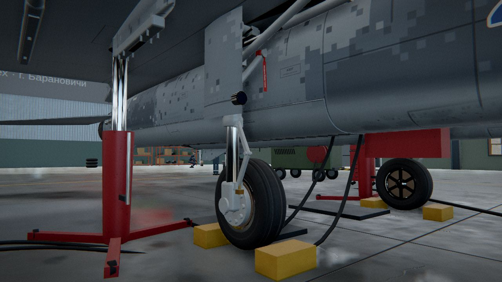
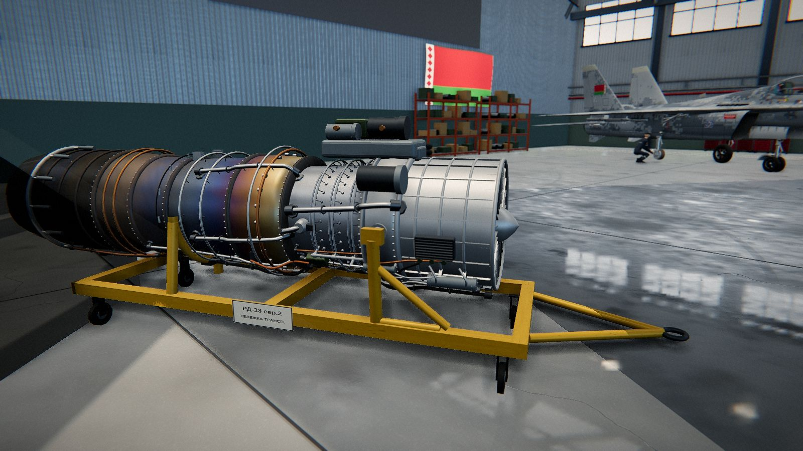
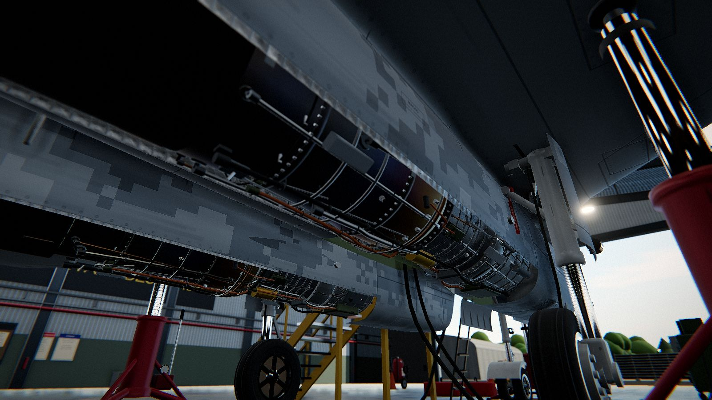
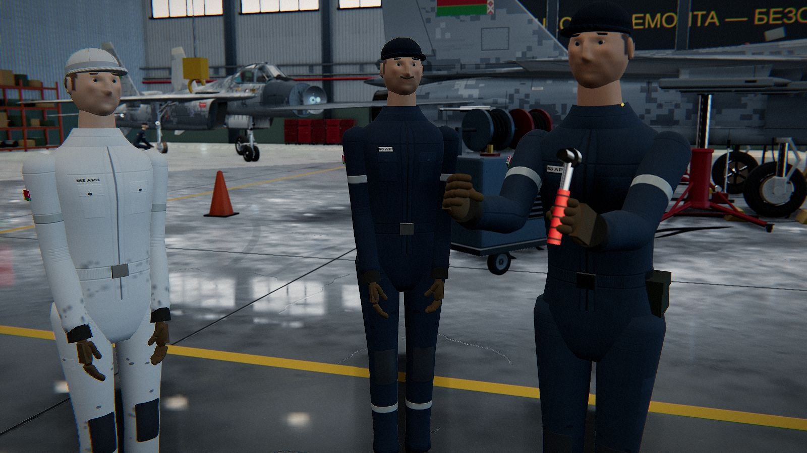
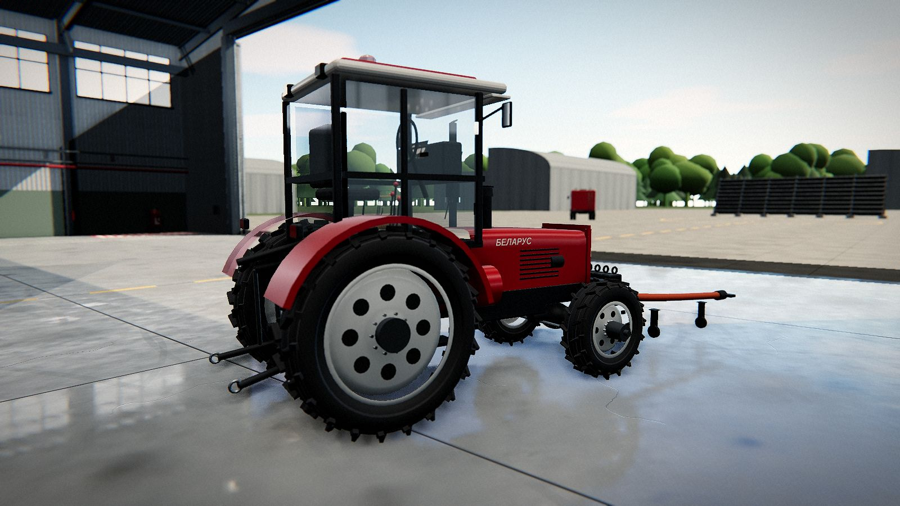

# 558 АРЗ — ремонт МиГ-29БМ

3D-симулятор авиатехника ремонтного цеха 558 авиационного ремонтного завода (Барановичи).
Персонаж ходит по ангару от первого или третьего лица, сам подходит к самолёту, поднимается на стремянку,
открывает фонарь, садится в кабину и своими руками дефектует, снимает и ставит узлы МиГ-29БМ.

**Играть:** откройте `dist/index.html` в браузере (Chrome, Edge, Firefox, Safari с WebGL2). Файл самодостаточный — three.js и весь код встроены.


| | |
|---|---|
|  |  |
|  |  |
|  |  |
|  |  |
|  | |

## Управление

| Клавиша | Действие |
|---|---|
| Щелчок по экрану | захват мыши, взгляд |
| W A S D / стрелки | ходьба |
| Shift | бег |
| Ctrl (или X) | присесть — под фюзеляж и мотогондолы |
| Пробел | прыжок |
| E | действие с объектом под прицелом (деталь, фонарь, ворота, доска нарядов, терминал, склад, тягач, КПА, ОТК) |
| Q | стремянка в кабину / сесть в кабину / выйти |
| F | фонарик |
| T | вид от 1-го / 3-го лица |
| C | режим обзора камерой (как в версии 1) |
| Esc / Tab | планшет с меню работ |
| N Z I V M B G R O H | наряды, задание, режим осмотра, ведомость, снабжение, склад, гонка РД-33, РЛС, ОТК, справка |

На телефоне — виртуальный джойстик, взгляд пальцем, кнопки «Действие», «Присесть», «Фонарь», «Планшет».

## Что внутри

- **Самолёт** построен процедурно по реальным пропорциям (длина 17,3 м, размах 11,36 м): лофтинг фюзеляжа по сечениям,
  наплывы и крыло с профилем NACA, зализы (гаргрот широкой дугой стекает на наплывы, мотогондолы сливаются с нижней
  поверхностью крыла), опущенный заострённый обтекатель РЛС, мотогондолы со скошенными на ~27° воздухозаборниками и открытыми на земле жалюзи,
  развалённые кили, цельноповоротные стабилизаторы, сопла из 18 створок, пилоны с АПУ-73, статические разрядники,
  датчики углов атаки, дополнительные ПВД, амбразура ГШ-30-1, чехол ПВД и замки шасси с красными лентами.
  Все 38 ремонтных узлов — отдельные съёмные детали.
- **Кабина**: ванна со шпангоутами, приборная доска из центральной секции, двух крыльев и боковых щитков, 20 объёмных
  приборов со стрелками и стёклами (КУС, ВДИ, УАП, ВАР, РВ, ИТА-6, Т газов, топливо, гидро, масло и др.), шар
  авиагоризонта, вращающаяся картушка ПНП, ИЛС-31 с коллиматором, ИПВ, табло сигнализации, «Экран-03М», боковые пульты
  и щиток АЗС со ~150 тумблерами, галетниками, кнопками и лампами, РУС, РУД, педали, зеркала. Приборы оживают: питание
  зажигает табло, ИЛС и лампы шасси, гироскоп авиагоризонта раскручивается, на гонке стрелки показывают обороты,
  температуру газов, давление масла и гидросистемы, РУД ходит по режимам, часы идут по реальному времени.
- **Кресло К-36ДМ**: заголовник с парашютным контейнером, направляющие, телескопические штанги, привязная система,
  ручки катапультирования, шланг КШУ, чека с флажком. **Фонарь**: плоское лобовое бронестекло со стойками, рамы
  прямоугольного сечения, уплотнение, перископ, ручки открытия.
- **Шасси**: амортстойки со шлиц-шарнирами, складными подкосами и цилиндрами уборки, створки с фарами, колёса КТ-150
  со спицованными дисками и многодисковыми тормозами, носовая спарка с механизмом разворота, фарами и щитком.
- **Отсеки**: двигательный (шпангоуты, подвеска, жгуты, топливный коллектор, термопары), РЛС (антенна Кассегрена
  на карданном приводе, волновод, ВЧ-блок с рёбрами охлаждения, силовой шпангоут), закабинный и гидравлический.
- **Двигатель РД-33**: входное устройство с обтекателем, лопатками направляющего аппарата и вентилятора, корпуса
  с фланцами и болтами, три кольца поворотных направляющих аппаратов КВД с рычагами цапф, валом синхронизации
  и гидроцилиндром, клапаны перепуска воздуха, агрегаты зажигания с высоковольтными проводами, маслобак,
  топливно-масляный теплообменник, блок регулятора, коробка приводов с агрегатами, топливные коллекторы с форсунками,
  коллекторы и трубы охлаждения турбины, смотровые лючки, дренажный коллектор, трубопроводы со штуцерами
  и накидными гайками, жгуты с разъёмами на хомутах, термопары, побежалость горячей части (соломенный → бронза →
  фиолетовый → синий), форсажная камера, сопло со створками и гидроцилиндрами. Двигатели в мотогондолах — те же
  детальные РД-33; над горячей частью — стёганые теплозащитные маты, вдоль отсека — противопожарный коллектор
  с распылителями и петли сигнализатора пожара. Запасной двигатель стоит в цехе на транспортной тележке.
- **Оборудование цеха**: гидроподъёмники-треноги с насосом и манометром, колодки с тросиком, двухосный прицеп
  аэродромного источника питания, гидроустановка, КПА РЛС, тележка с азотными баллонами, инструментальные тумбы,
  верстаки с тисками и инструментом, огнетушители ОП-100, заглушки воздухозаборников.
- **Техника**: трактор «Беларус» МТЗ-82.1 — капот с решёткой, фарами и боковыми жалюзи, кабина со стойками, дверями,
  стеклоочистителем, зеркалами, рабочими фарами и маячком, салон с сиденьем, рулём, щитком приборов и рычагами,
  шины с грунтозацепами «ёлочкой», диски с отверстиями и гайками, передний ведущий мост с колёсными редукторами,
  балластные грузы, двигатель, глушитель, навеска и водило к носовой стойке МиГа. У ворот — аэродромный тягач,
  у газовочной площадки — пожарная автоцистерна с отсеками под рольставнями, лестницей и проблесковыми маячками.
- **Окраска планера** — свой шейдер поверх `MeshPhysicalMaterial`: объёмный цифровой камуфляж (рисунок задан
  в пространстве самолёта, поэтому непрерывен на всех деталях), флаги Беларуси на внешних сторонах килей и бортовой
  номер прямо в шейдере, разделка панелей, заклёпки и замки,
  грязь, потёки, копоть у сопел, потёртости краски до металла. Карты рисуются в проекциях «сверху» и «сбоку»,
  поэтому швы непрерывно проходят через фюзеляж, крыло и съёмные люки. Бортовой номер, флаги и трафареты у точек
  обслуживания (азот, масло, гидросистема, кислород, пиросредства, аварийное открытие фонаря) — декали.
- **Ангар**: стальные рамы, профнастил, ленточное остекление, зенитные фонари, мостовой кран, ворота на рельсах,
  полимерный пол с разметкой, стеллажи, верстаки, тягач, КПА РЛС, АПА, УПГ, запасной РД-33, кабина ОТК, второй МиГ в дальнем пролёте.
  Снаружи — перрон, газовочная площадка с газоотбойником, пожарная машина, лес, небо с атмосферным рассеянием.
- **Рендер**: PBR, отражения окружения (кубическая карта снимается с самой сцены), мягкие тени солнца и цеховых светильников,
  запечённая контактная тень под самолётом, GTAO, bloom, тональная компрессия ACES, резкость и раздельное тонирование,
  глубина резкости в режиме обзора (Высокое/Ультра), планарные отражения полимерного пола, объёмные лучи и пыль,
  факел форсажа со скачками уплотнения, марево над соплом. Четыре пресета качества и автоснижение при низкой частоте кадров.
- **Персонаж**: капсула с физикой на BVH (three-mesh-bvh), лестницы, приседание. Модель техника — цельное тело на скелете
  со скиннингом (локти и колени гнутся без швов), лицо с глазами, веками, бровями, носом и губами, уши, перчатки
  с согнутыми под инструмент пальцами, комбинезон с молнией, швами, нагрудными и накладными карманами, наколенниками,
  светоотражающими полосами, биркой и надписью «558 АРЗ» на спине, ремень с подсумком, флажок на рукаве, ботинки
  с подошвой и шнурками, кепка. Инструмент — по виду работы: трещотка, динамометрический ключ, отвёртка с рожковым
  ключом, мультиметр со щупами; те же руки и инструмент видны от первого лица.
- **Работники цеха**: мастер участка (с усами), слесарь и техник у второго МиГа, контролёр ОТК в белой форме.
  Поворачиваются к игроку, по E подсказывают, что делать дальше по наряду.
- **Физическое взаимодействие**: к узлу нужно подойти (дотянуться рукой), на верх фюзеляжа — подняться по стремянке
  и пройти по наплыву, в кабину — по бортовой стремянке; фонарь открывается, в кабине включается бортовое питание
  (если батарея исправна), ворота ангара открываются с пульта, самолёт выкатывается тягачом на газовочную площадку.
- **Звук** синтезируется Web Audio: шаги по бетону и металлу, гул цеха, трещотка и гайковёрт, двигатель РД-33.

Игровая логика (наряды, скрытые дефекты, снабжение, Б/У детали, ремкомплекты, гонка двигателей, настройка РЛС «Топаз», ОТК,
должности) перенесена из первой версии (`legacy/v1-original.html`). Сохранения совместимы.

## Сборка

```bash
npm install
npm run build      # dist/index.html (+ dist/artifact.html без обёртки документа)
npm run watch      # dist/dev.html, пересборка при изменениях (с source map)
```

Исходники: `src/view` — графика (модель самолёта, ангар, материалы, эффекты, рендер), `src/world` — физика и персонаж,
`src/game` — игровая логика и данные, `src/main.js` — режимы, ввод, взаимодействие, игровой цикл.
